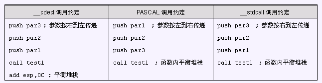

# 函数调用方式

### 一、__cdecl

__cdecl 是 C Declaration 的缩写，表示 C 语言默认的函数调用方法：所有**参数从右到左依次入栈**，这些**参数由调用者清除**，称为**手动清栈**。被调用函数不会要求调用者传递多少参数，调用者传递过多或者过少的参数，甚至完全不同的参数都不会产生编译阶段的错误。

### 二、__stdcall

__stdcall 是 Standard Call 的缩写，是 C++ 的标准调用方式：所有**参数从右到左依次入栈**，如果是**调用类成员**的话，最后一个入栈的是 **this** **指针**。这些堆栈中的**参数由被调用的函数在返回后清除**，使用的指令是 retn X，X 表示参数占用的字节数，CPU 在 ret 之后自动弹出 X 个字节的堆栈空间，称为**自动清栈**。函数在编译的时候就必须确定参数个数，并且调用者必须严格的控制参数的生成，不能多，不能少，否则返回后会出错。

### 三、__pascal

\_\_pascal 是 Pascal 语言（Delphi）的函数调用方式，也可以在 C/C++ 中使用，**参数从左到右依次入栈**。返回时的**清栈方式与 __stdcall 相同**。

### 四、__fastcall

\_\_fastcall 是编译器指定的快速调用方式。由于大多数的函数参数个数很少，使用堆栈传递比较费时。因此 \__fastcall 通常规定将**前两个（或若干个）参数由寄存器传递**，其余参数还是通过堆栈传递。不同编译器编译的程序规定的寄存器不同，返回方式和 __stdcall 相当。

### 五、__thiscall

\_\_thiscall 是为了解决类成员调用中 this 指针传递而规定的。\__thiscall 要求把 this 指针放在特定寄存器中，该寄存器由编译器决定。VC 使用 ecx，Borland 的 C++ 编译器使用 eax。返回方式和 __stdcall 相当。

### 六、注意

\_\_fastcall 和 \_\_thiscall 涉及的寄存器由编译器决定，因此不能用作跨编译器的接口。所以 Windows 上的 COM 对象接口都定义为 __stdcall 调用方式。

C 语言中不加说明默认函数为 __cdecl 方式（C 中也只能用这种方式），C++ 也一样，但是默认的调用方式可以在 IDE 环境中设置。

### 七、例子

test1(par1, par2, par3);

### 八、x64平台下调用约定

64 位平台下只有一种变形的 __fastcall 的调用约定，前4个参数先放入 ecx、edx、r8、r9 寄存器，更多的参数放入栈区。这个时候要注意的是，在64位下，系统还是为前4个参数预留了栈区空间（每个栈空间大小为8字节，共32字节大小），然后将基存器的值放入所预留的栈区空间。

为什么系统要多此一举呢？我们都知道寄存器传递参数速度要远大于栈区传值，而将寄存器中的值再放入栈区预留空间，这是为了防止在传递参数的过程中，寄存器需要接收其他的值而导致参数无法传递，或者其他值无法接收的情况。

